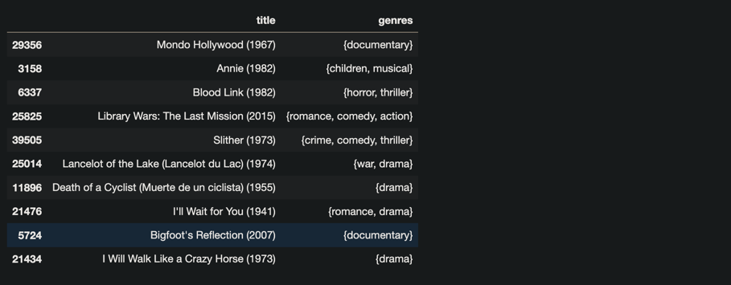
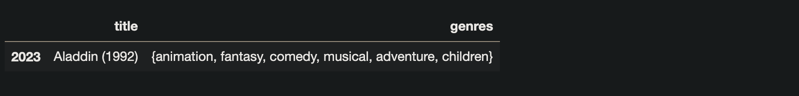
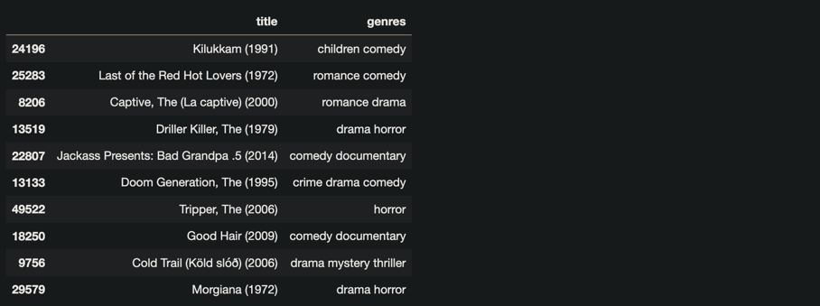

---
# Page settings
layout: default

title: Recommendation Engine
description: Let's build our recommendation engine! We'll start by inspecting and cleaning our data. Then we'll prepare the feature that we will use in our ML algorithms.  Finally, we'll write some code and build our engine to recommend movies to users based on content!

---

## Step 1 - Inspection

Let's read in our data from our csv and then inspect it.

```python
import pandas as pd
from typing import List
from utils.cleaning import lower_case_and_strip_spaces
from utils.cleaning import combine_genres_list
```


```python
movies_df: pd.DataFrame = pd.read_csv('input/all_movies.csv')
movies_df.sample(20)
```

```python
movies_df
```

```python
movies_df.shape[0]
```
58093

## Step 2 - Cleaning

Now let's clean our input data. Some things we'll do here are:

1. Cleaning up strings
2. Removing unwanted rows
3. Checking our data for duplicates

```python
movies_cleaned_df = movies_df.copy()
movies_cleaned_df['genres'] = movies_cleaned_df['genres'].apply(lower_case_and_strip_spaces)
```
```python
def lower_case_and_strip_spaces_notebook(input: str) -> str:
    return input.lower().strip()
```
```python
input_1 = " comedy|FANTASY|Action "
expected_1 = "comedy|fantasy|action"

input_2 = " FANTASY "
expected_2 = "fantasy"

input_3 = "comedy"
expected_3 = "comedy"
```
```python
def test_lower_case_and_strip_spaces(input: str, expected_output: str):
    assert lower_case_and_strip_spaces_notebook(input) == expected_output
```
```python
test_lower_case_and_strip_spaces(input_1, expected_1)
test_lower_case_and_strip_spaces(input_2, expected_2)
test_lower_case_and_strip_spaces(input_3, expected_3)
```
```python
movies_cleaned_df.sample(10)
```

```python
movies_cleaned_df = movies_cleaned_df.loc[movies_cleaned_df['genres'] != '(no genres listed)']
```
```python
movies_cleaned_df.shape[0]
```
53832
```python
assert movies_cleaned_df.shape[0] < movies_df.shape[0]
```
```python
movies_cleaned_df.head(5)
```


### Checking for Duplicates
We need to define what a "duplicate" is.

```python
duplicated_by_title = movies_cleaned_df.duplicated(['title'])
duplicated_by_title_df = movies_cleaned_df.loc[duplicated_by_title]
duplicated_by_title_df.shape
```
(66, 3)

The movies that are duplicated by title and genre
```python
duplicated_by_title_and_genre = movies_cleaned_df.duplicated(['title', 'genres'])
duplicated_by_title_and_genre_df = movies_cleaned_df.loc[duplicated_by_title_and_genre]
duplicated_by_title_and_genre_df.shape
```
(14, 3)

The movies that are duplicated by title but their generes don't match

```python
newdf=pd.concat([duplicated_by_title_and_genre_df,duplicated_by_title_df]).drop_duplicates(keep=False)
records_duplicated_by_title_only = set(newdf['title'])
records_duplicated_by_title_only
```
```python
{'20,000 Leagues Under the Sea (1997)',
 'Absolution (2015)',
 'Aftermath (2012)',
 'Aladdin (1992)',
 'Blackout (2007)',
 'Cargo (2017)',
 'Casanova (2005)',
 'Chaos (2005)',
 'Classmates (2016)',
 'Clockstoppers (2002)',
 'Confessions of a Dangerous Mind (2002)',
 'Delirium (2014)',
 'Deranged (2012)',
 'Ecstasy (2011)',
 'Eden (2014)',
 'Emma (1996)',
 'Eros (2004)',
 'Forsaken (2016)',
 'Free Fall (2014)',
 'Frozen (2010)',
 'Good People (2014)',
 'Gossip (2000)',
 'Grace (2014)',
 'Hamlet (2000)',
 'Holiday (2014)',
 'Hostage (2005)',
 'Interrogation (2016)',
 'Journey to the Center of the Earth (2008)',
 'Lagaan: Once Upon a Time in India (2001)',
 'Men with Guns (1997)',
 'Noise (2007)',
 'Office (2015)',
 'Paradise (2013)',
 'Rose (2011)',
 'Saturn 3 (1980)',
 'Shelter (2015)',
 'Sing (2016)',
 'Slow Burn (2000)',
 'Stranded (2015)',
 'Tag (2015)',
 'The Boss (2016)',
 'The Break-In (2016)',
 'The Connection (2014)',
 'The Dream Team (2012)',
 'The Midnight Man (2016)',
 'The Promise (2016)',
 'The Reunion (2011)',
 'The Void (2016)',
 'Truth (2015)',
 'Veronica (2017)',
 'War of the Worlds (2005)',
 'Weekend (2011)'}
```
Now we can locate an example using the titles in our list.
```python
ALADDIN = 'Aladdin (1992)'
def get_aladdin_example(df: pd.DataFrame) -> pd.DataFrame:
    return df.loc[df['title'] == ALADDIN]
movies_cleaned_df.loc[movies_cleaned_df['title'] == ALADDIN]
```


## Step 3 - Feature Preparation

Feature: A descriptive attribute that can be used in our algorithms.

Let's use our genres as our feature.

First we need to group by movie title.
```python
movies_grouped_by_title_df = movies_cleaned_df.copy()
movies_grouped_by_title_df = movies_grouped_by_title_df.groupby('title').agg({'genres': lambda x: x.to_list()}).reset_index()
movies_grouped_by_title_df.sample(10)
```


```python
get_aladdin_example(movies_grouped_by_title_df)
```


Clean up the genres list.
```python
movies_unique_genres_df = movies_grouped_by_title_df.copy()
movies_unique_genres_df['genres'] = movies_unique_genres_df['genres'].apply(combine_genres_list)
movies_unique_genres_df.sample(10)
```

```python
get_aladdin_example(movies_unique_genres_df)
```


Now let's turn our genres column into a space separated list of genres as if they were words in a document.
```python
movies_with_document_description_df = movies_unique_genres_df.copy()
movies_with_document_description_df['genres'] = movies_with_document_description_df['genres'].apply(lambda x: ' '.join(x))
movies_with_document_description_df.sample(10)
```


## Step 4 - Building our engine

```python
for_genres_list_df = movies_unique_genres_df.copy()
for_genres_list_df = for_genres_list_df['genres'].explode().reset_index()
all_genres = list(for_genres_list_df.genres.unique())
all_genres
```
```python
['musical',
 'drama',
 'comedy',
 'horror',
 'mystery',
 'thriller',
 'documentary',
 'crime',
 'western',
 'animation',
 'war',
 'action',
 'fantasy',
 'adventure',
 'romance',
 'children',
 'sci-fi',
 'film-noir',
 'imax']
```
```python
len(all_genres)
```
19
```python
from sklearn.feature_extraction.text import TfidfVectorizer
tf = TfidfVectorizer(vocabulary=all_genres)
tfidf_matrix = tf.fit_transform(movies_with_document_description_df['genres'])
pd.DataFrame(tfidf_matrix.toarray())
```

```python
from sklearn.metrics.pairwise import cosine_similarity
cosine_sim = cosine_similarity(tfidf_matrix, tfidf_matrix)
pd.DataFrame(cosine_sim)
```

```python
from utils.recommendation import get_similar_movies

similar_movies = get_similar_movies('Toy Story (1995)', cosine_sim, movies_with_document_description_df, 20)
similar_movies
```
```python
['Antz (1998)',
 'Asterix and the Vikings (Astérix et les Vikings) (2006)',
 'Boxtrolls, The (2014)',
 'Brother Bear 2 (2006)',
 'DuckTales: The Movie - Treasure of the Lost Lamp (1990)',
 "Emperor's New Groove, The (2000)",
 'Home (2015)',
 'Moana (2016)',
 'Monsters, Inc. (2001)',
 "Olaf's Frozen Adventure (2017)",
 'Penguin Highway (2018)',
 'Puss in Book: Trapped in an Epic Tale (2017)',
 'Scooby-Doo! Mask of the Blue Falcon (2012)',
 'Shrek the Third (2007)',
 'Space Jam (1996)',
 'Tale of Despereaux, The (2008)',
 'Tangled: Before Ever After (2017)',
 'The Croods 2 (2017)',
 'The Dragon Spell (2016)',
 'The Good Dinosaur (2015)']
```